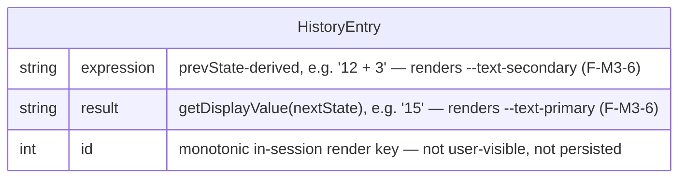

# M3 Data Model — In-Memory Tape

> **This is not a database schema, and barely a "data model" at all.** M3's entire state is **one
> ordered array of completed-calculation entries**, held in module memory, appended when M2's equals
> resolves on the genuine pending-operator path, and discarded when the tab closes (F-M3-2). No
> persistence, no `localStorage`, no serialization, no schema. The Domain Lens pre-cleared exactly this:
> *"Calculation history … is at most ephemeral in-memory state, not a data model"* (`00-domain-lens.md:67`).
>
> This file is honest about that scale (anti-inflation, CP-13): the entity is two strings and an id; the
> container is an array; the lifecycle is append + clear. The bulk below is the **derivation contract** —
> where each string comes from — not stored richness, because there is almost none to store.
>
> M3 adds **zero** fields to `EngineState`, calls **no** M1 reducer, and reads M1 only through the public
> `EngineState` shape + `getDisplayValue` (INT-M3-2/3, F-M3-4). It inherits `OPERATOR_TO_GLYPH`
> (`src/ui/operator-map.ts`, F-M3-9) for expression rendering — it does not restate or redefine it.

---

## 1. The entity — `HistoryEntry`

One completed calculation, captured at the moment M2's equals resolves on the genuine pending-operator
path (INT-M3-1). Two display strings plus one internal stable key:

```ts
interface HistoryEntry {
  /** Pre-formatted expression, e.g. "12 + 3". Built from prevState (§3). Renders in --text-secondary. */
  expression: string;
  /** Pre-formatted result, e.g. "15". = getDisplayValue(nextState) (§3). Renders in --text-primary. */
  result: string;
  /** Stable identity for the render layer's keyed list + slide-in motion. NOT business data. (§2) */
  id: number;
}
```

Both `expression` and `result` are **plain `string`s, already display-ready** — formatted at capture
time, stored as text, never recomputed at render. M3 holds **no `Decimal`, no `Operator`, no
`EngineState`** in an entry. The arithmetic happened in M1; M3 froze its textual outcome (F-M3-4). The
typography split (expression secondary / result primary, F-M3-6) is a CSS concern applied to these two
fields — the data model just keeps them as two distinct strings so the render layer can style them apart.

### Why `id` earns its place (anti-ceremony justification)

`id` is **not** decoration. The render layer (F-M3-7) slides each new line in from the top edge while
older entries shift down — a keyed list. A stable per-entry key lets the renderer (or a future framework
diff) match DOM nodes to entries across appends without re-animating the whole list. Two entries can have
**identical** `expression` + `result` (e.g. `"2 + 2" = "4"` computed twice), so content is not a safe key.
A monotonic counter is the cheapest stable identity that survives this. It is an **internal render key,
not user-visible and not persisted** — it resets to its seed every tab load along with the array.

> **Decision D-M3-DM-02 — entry carries a monotonic `id` as render key.** See `_decisions.md`.

---

## 2. The container — `tape`, a module-scoped ordered array

```ts
let tape: HistoryEntry[] = [];   // module-private; the single source of truth for M3
let nextId = 0;                  // monotonic seed for HistoryEntry.id (§1)
```

**Ordering — append-chronological (oldest-first in the array), newest-at-the-visible-edge in the view.**
The array stores entries **oldest → newest** (a plain `push`); the *render* layer places the newest at the
visible edge per F-M3-5 ("most-recent at the visible edge") + F-M3-7 (new line slides in from the top). The
**data** stays in natural append order; **presentation** owns "which edge is the top." Decoupling them keeps
`append` a trivial `push` and leaves the visual edge a CSS/render decision (e.g. `flex-direction` or a
reversed read) for `04-ui.md` — not a data-structure inversion.

> **Decision D-M3-DM-01 — array is oldest-first; newest-edge is a render concern.** See `_decisions.md`.

The `tape` and `nextId` are **module-private** (not on `EngineState`, not global, not persisted). The exact
host primitive (`let` re-assignment vs a framework signal/store cell) mirrors M2's deferral
(`02-calculator-ui/01-data-model.md §1`, D-M2-DM-01) → it is `06-tech-choices.md`'s call once the M3 UI
approach is fixed. This file pins the **shape** (one ordered array of `HistoryEntry`), not the primitive.

---

## 3. Derivation contract — where the two strings come from (INT-M3-2)

An entry is built **only** at the INT-M3-1 recording predicate (cited from `_briefing.md`, not restated):
`prevState.pendingOperator !== null` AND `nextState.errorState === null` AND
`nextState.justEvaluated === true`. The recording hook sees **both** `prevState` (before the equals
reducer) and `nextState` (after) — both are required (INT-M3-2). The hook *seam mechanism* is
`06-tech-choices.md`'s decision (INT-M3-3); this file owns only what the two strings derive **from**.

| Field | Derived from | Formula |
|---|---|---|
| `expression` | **`prevState`** | `prevState.accumulator.toString()` + `" "` + `OPERATOR_TO_GLYPH[prevState.pendingOperator]` + `" "` + `prevState.entryBuffer` |
| `result` | **`nextState`** | `getDisplayValue(nextState)` |
| `id` | module counter | `nextId++` |

Notes that keep the formulas honest:

- **`prevState.accumulator` is non-null on this path.** The predicate requires `prevState.pendingOperator
  !== null`; in M1, a pending operator implies a stored `accumulator` (it was latched when the operator was
  pressed). So `.toString()` on it is safe — it is a *read*, not arithmetic (F-M3-4; same posture as M2's
  pending-line note, `02-calculator-ui/01-data-model.md §3.2`).
- **`OPERATOR_TO_GLYPH[prevState.pendingOperator]`** yields the true-Unicode glyph (`+ − × ÷`, U+002B /
  U+2212 / U+00D7 / U+00F7) — M3 inherits this map (F-M3-9), does not redefine it. Subtract is the real
  minus U+2212, not a hyphen.
- **`getDisplayValue(nextState)` returns a numeric `string` here, never an `ErrorTag`.** Its body returns
  `errorState` when non-null, else `entryBuffer` (`src/engine.ts:341-346`); the predicate already gates on
  `nextState.errorState === null`, so the `ErrorTag` branch is structurally unreachable at capture. `result`
  is therefore always a plain value string. (Equivalent to reading `nextState.entryBuffer` directly, per
  INT-M3-2; `getDisplayValue` is the public, intention-revealing read.)
- **Spacing/format is fixed at capture, not at render.** The single-space `"12 + 3"` form is a default; the
  expression *layout* (one line `12 + 3 = 15` vs two lines) is OQ-M3-2, a UX-interpretation call for
  `04-ui.md`. If `04-ui` chooses two lines, the `result` string is reused as-is and `expression` need not
  carry the `=`; this data model already keeps them as two separate fields so either layout is free. The
  data model commits only to: *each entry holds one expression string and one result string, both
  display-ready.*

**Chained-calculation note (INT-M3-4, cited not restated):** because M1 is immediate-execution, `12 + 3 + 4
=` records the **final binary step** `"15 + 4" = "19"`, not `"12 + 3 + 4"` — `prevState.accumulator` is
already `15` at the final equals. This is expected basic-calculator behaviour; `05-edge-cases.md` owns the
user-facing framing.

---

## 4. Lifecycle — append + clear, nothing else

| Moment | What happens to `tape` |
|---|---|
| **Page load / app mount** | `tape = []`, `nextId = 0`. Empty tape; the panel renders its empty state (UI concern, `04-ui.md`). |
| **Equals resolves on the genuine path (INT-M3-1 predicate true)** | build one `HistoryEntry` (§3), `tape.push(entry)`. The render layer slides the new line in at the visible edge (F-M3-7). |
| **Equals on any non-recording path** | **no-op** — the predicate excludes it (repeated `=`, divide-by-zero / overflow, bare `=` with nothing pending). No entry, no `id` consumed (`nextId` only advances on a real append). The exclusion is the predicate's job, not a special case here (cited `_briefing.md` INT-M3-1). |
| **AC (all-clear)** | `tape = []` (and the empty state re-renders). M3 observes the same AC signal M2's `inputAllClear` represents; **whether AC also clears the tape is the module baseline** (`03-modules.md:82`) — confirmed at the data level: AC empties the array. A *dedicated* "clear history" affordance is a separate UX question (OQ-M3-1, `04-ui.md`); if added, it runs the same `tape = []` clear. `nextId` MAY reset to 0 on clear or keep advancing — either is correct since `id` is only an in-session render key; keeping it advancing is simplest (no reset branch) and avoids any chance of a stale DOM node colliding with a reused id during the clear→append animation. |
| **CE (clear-entry)** | **no-op on the tape.** CE resets M2's current entry buffer, not history; no completed calculation is added or removed. |
| **Tab close / reload** | `tape` is **gone** — in-memory only (F-M3-2). Next load restarts at the empty array. No save, no restore, no cross-tab sync. |

There is **no persistence, no `localStorage`, no serialization, no migration, no versioning**. The array's
entire lifetime is one tab session.

> **AC-clears-tape is stated here as a data fact; the *clear UX* (AC-only vs dedicated control) is
> OQ-M3-1, deferred to `04-ui.md`.** This file commits only that *clearing means `tape = []`*, regardless
> of which affordance triggers it.

---

## 5. Tape length — unbounded array + scroll (OQ-M3-4 resolved here)

OQ-M3-4 (tape length cap: unbounded vs soft-cap) is a **data-shape** question, so it is resolved at this
level rather than deferred. **Decision: unbounded `push`, no cap; growth is absorbed by the scroll the
design already mandates** (F-M3-5: desktop panel scrollable, phone capped-height scrollable).

Rationale (CP-7 AI-autonomous, technical):

- **Truthful to scale.** The array only grows on a *human pressing equals on a completed calculation* —
  realistically tens of entries in a session, not thousands. There is no machine-driven or network-driven
  append path. A cap guards against a load that this zero-stakes single-user surface structurally cannot
  generate.
- **A cap adds a real eviction branch for no real benefit** (CP-13 over-engineering): "keep last N" means a
  `shift`/slice on every append past N, a chosen-N magic number to justify, and an interaction with the
  slide-in motion (the evicted top line must animate out) — bespoke code the profile-fit lens (F-M3-10,
  *least bespoke code*) says to avoid absent a documented constraint. There is none.
- **Scroll already exists** (F-M3-5, F-M3-8 slot) and is the truthful overflow handling — the same "no data
  loss" trust principle M2 honoured for its readout (M2 shrink→scroll, never truncate, `02-calculator-ui`
  D-006). Capping the tape would *silently drop* completed calculations the user might glance back at —
  exactly the data loss that principle forbids.

> **Decision D-M3-DM-03 — unbounded tape, overflow handled by scroll.** See `_decisions.md`. (Per-entry
> long-string overflow — wrap/truncate inside the narrow panel — is the *separate* OQ-M3-5, a render/edge
> concern for `05-edge-cases.md`, not a length-cap question.)

---

## 6. Canonical entity diagram (Mermaid `erDiagram`)

The diagram is the **canonical source** for the entity; prose above is annotation. `HistoryEntry` is a
standalone in-memory record — it relates to no other persisted entity (there are none). The only structural
"relationship" is the container: a `tape` holds zero-or-more entries, which the diagram notes as a comment
rather than over-modelling a second entity for a plain array.



---

## Decisions logged this file

| ID | Decision | Authority |
|---|---|---|
| D-M3-DM-01 | `tape` is an oldest-first `HistoryEntry[]` (plain `push` append); "newest at the visible edge" is a render concern, not a data inversion. | CP-7 technical |
| D-M3-DM-02 | Each `HistoryEntry` carries a monotonic `id: number` as a stable render key (keyed slide-in motion; content is not unique). Internal, not user-visible, not persisted. | CP-7 technical |
| D-M3-DM-03 | Tape is **unbounded** (no length cap); overflow is handled by the design-mandated scroll, never by evicting entries (no-data-loss, profile-fit least-bespoke-code). Resolves OQ-M3-4 at the data level. | CP-7 technical |

---

## Dependencies & deferrals (summary)

- **Hook seam mechanism** (how M3 observes `(prevState, nextState)` around `dispatch()`) → `06-tech-choices.md` (INT-M3-3 head-to-head). This file fixes *what is recorded*, not *how it is observed*.
- **Host primitive** for `tape` (`let` vs signal/store cell) → `06-tech-choices.md`, once the M3 UI approach is picked (mirrors M2 D-M2-DM-01). This file fixes the shape (one ordered array).
- **Clear UX** (AC-only vs dedicated "clear history" control) → OQ-M3-1, `04-ui.md`. This file fixes only that *clearing = `tape = []`*.
- **Entry layout** (one line vs two lines; whether `expression` carries the `=`) → OQ-M3-2, `04-ui.md`. The two-field shape here supports either.
- **Long expression/result overflow inside the narrow panel** (wrap / truncate / ellipsis) → OQ-M3-5, `05-edge-cases.md`. Distinct from the length cap resolved in §5.
- **Chained-calculation user framing** (records final binary step) → INT-M3-4, `05-edge-cases.md`.
